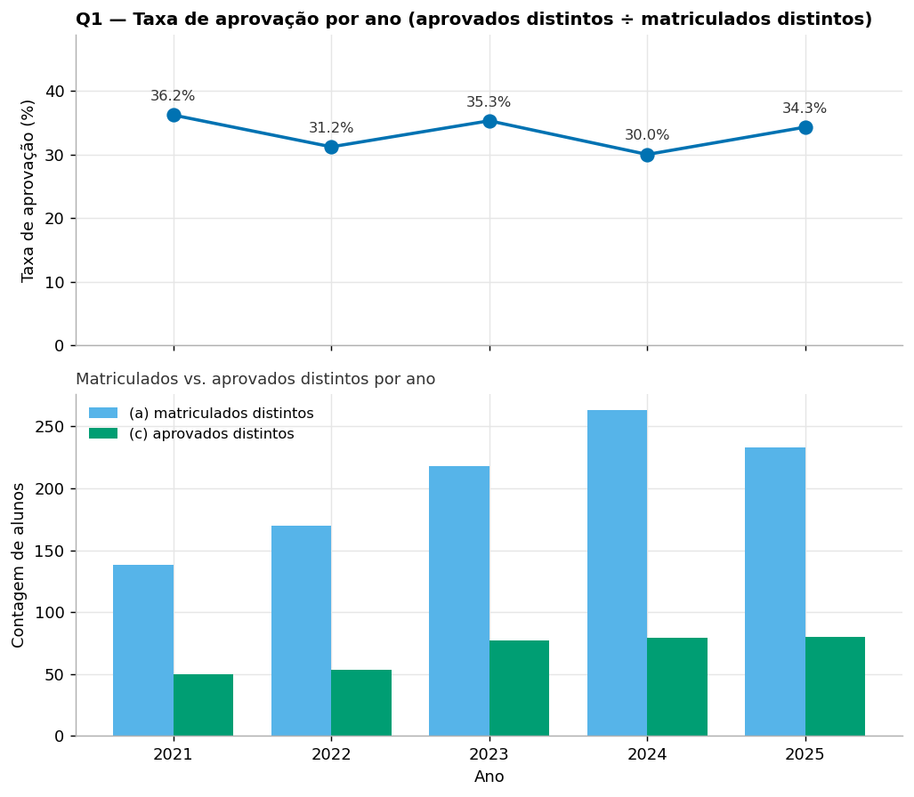
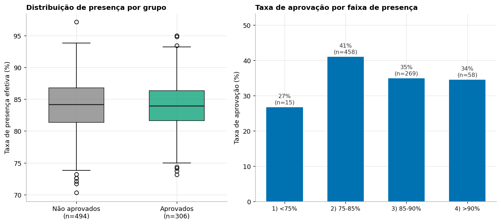
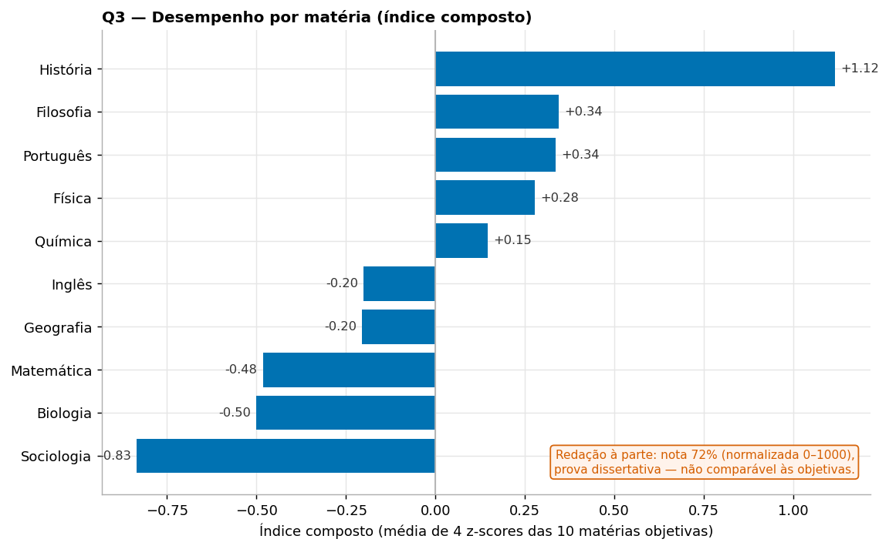
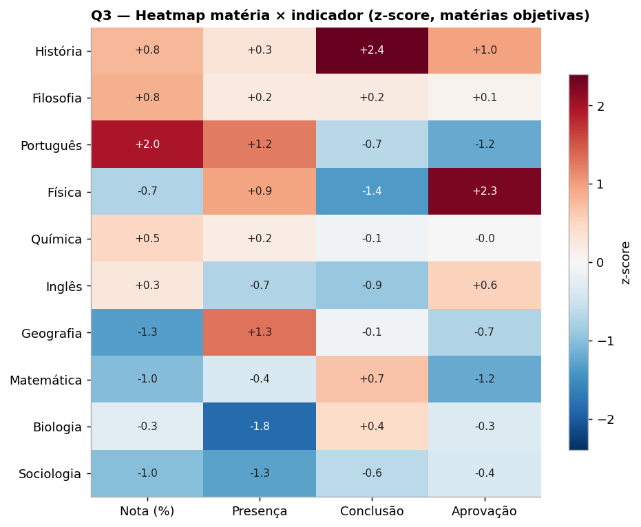
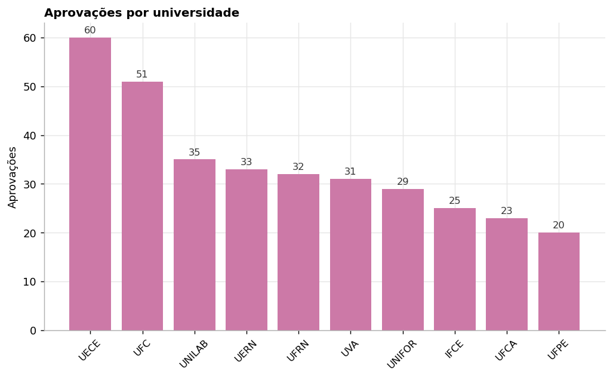

# AprovaEdu Analytics - Relatório Final

Análise dos dados de uma rede de cursinhos pré-vestibular (2021–2025) para apoiar a coordenação
pedagógica em três frentes: desempenho dos alunos, efetividade dos cursos e fatores associados à
aprovação no vestibular.

---

## 1. Sumário executivo

- **A taxa de aprovação é estável em torno de 33%** (entre 30,0% e 36,2% ao longo dos cinco anos),
  sem tendência clara de melhora ou piora. O volume absoluto de matrículas e de aprovações cresce,
  mas a *proporção* de aprovados se mantém.
- **Não há evidência de que presença nas aulas esteja associada à aprovação.** Aprovados e não
  aprovados têm a mesma presença média (84,0%), e dois testes estatísticos formais não apontam
  associação. A presença é muito concentrada (quase todos entre 81% e 87%), o que limita seu poder
  de diferenciar os grupos.
- **As matérias têm desempenho parecido entre si**, as diferenças no índice composto são modestas.
  História aparece à frente; Sociologia, Matemática e Biologia atrás. Redação é analisada à parte
  por estar numa escala e num tipo de prova diferentes.
- **O maior achado de negócio pode ser a qualidade do dado na origem.** O volume de retrabalho de
  limpeza que esta base exigiu (matéria escrita de 5 formas diferentes em 5 tabelas, escala de nota
  inconsistente, duplicidade de cadastro em aprovações) é, em si, um problema de processo que
  antecede qualquer análise.
- **O canal de captação mostra diferença relevante:** alunos vindos de *Indicação* aprovam mais
  (43,4%) do que os de *WhatsApp* (31,1%).

---

## 2. Contexto e objetivo

A rede acumulou, ao longo de cinco anos, dados de alunos, professores, matérias, cursos, simulados,
presença e aprovações, vindos de fontes internas diferentes, daí a heterogeneidade de formato e
qualidade. A coordenação quer entender melhor o desempenho, a efetividade dos cursos e os fatores de
aprovação. Este relatório responde às quatro perguntas obrigatórias:

1. Evolução da taxa de aprovação ao longo dos anos.
2. Relação entre presença nas aulas e aprovação.
3. Cursos/matérias com melhor desempenho.
4. Recomendações práticas para a coordenação.

---

## 3. Dados e metodologia

**Fonte.** Nove tabelas relacionais: quatro dimensões (`estudantes`, `professores`,
`ofertas_curso`, `simulados`) e cinco fatos (`matriculas`, `aulas`, `presencas_aulas`,
`resultados_simulados`, `aprovacoes_vestibular`), totalizando ~110 mil linhas. A integridade
referencial da base bruta é intacta (chaves primárias únicas, sem chaves estrangeiras sozinhas); o
trabalho de tratamento incidiu sobre **valor e escala**, não sobre chaves.

**Modelo.** Os dados tratados são carregados num banco relacional SQLite com chaves primárias e
estrangeiras declaradas. Sobre ele são construídas duas bases analíticas: `base_analitica_aluno`
(uma linha por aluno) e `base_analitica_materia` (uma linha por matéria). O detalhe de cada decisão
de tratamento está em [`DECISOES.md`](DECISOES.md); o dicionário completo em
[`docs/data_dictionary.md`](../docs/data_dictionary.md).

**Decisões que mudam o resultado** (resumo — detalhe em `DECISOES.md`):

- **Escala de nota por matéria.** Redação usa a escala ENEM (0–1000); as demais matérias, 0–100.
  Notas fora da faixa da própria matéria viram ausentes, nunca truncadas. Aplicar uma faixa 0–100
  global descartaria toda a Redação, erro que mudaria a resposta da Q3.
- **Canonicalização com falha alta.** Toda categórica passa por um mapa canônico explícito; um valor
  desconhecido interrompe o pipeline em vez de criar uma categoria fantasma.
- **Presença efetiva** = Presente ou Atrasado.
- **Taxa de aprovação** = alunos distintos aprovados ÷ matriculados distintos (status ativo,
  concluída ou trancada).
- **Deduplicação** de negócio nas tabelas de fato e remoção de 15 duplicidades de cadastro em
  aprovações (identificadas pelo campo `chamada` com par idêntico confirmado).

---

## 4. Respostas às perguntas obrigatórias

### Q1 - Evolução da taxa de aprovação por ano

A base não traz a taxa pronta, e há três contagens facilmente confundíveis. Apresentá-las lado a
lado deixa o denominador auditável:

| Ano | (a) Matriculados distintos | (b) Aprovações brutas | Aprovações após dedup | (c) Aprovados distintos | Taxa = c/a |
|----:|---:|---:|---:|---:|---:|
| 2021 | 138 | 50 | 50 | 50 | **36,2%** |
| 2022 | 170 | 53 | 53 | 53 | **31,2%** |
| 2023 | 218 | 78 | 77 | 77 | **35,3%** |
| 2024 | 263 | 87 | 79 | 79 | **30,0%** |
| 2025 | 233 | 86 | 80 | 80 | **34,3%** |

A **taxa correta é (c) ÷ (a)**, pessoas no numerador e no denominador. Dividir o volume de eventos
(b) por matriculados misturaria contagem de eventos com contagem de pessoas e poderia gerar valores
acima de 100%. Note que a coluna (b) bruta (354 no total) cai para 339 após remover as 15
duplicidades de cadastro; depois disso, por ano, o volume de aprovações coincide com aprovados
distintos (nenhum aluno tem duas aprovações no mesmo ano).

**Leitura.** A taxa é **estável, na casa de 30–36%** (média 33,4%), sem tendência forte. O que muda
é a *escala*: matrículas quase dobram (138 → 263 no pico) e as aprovações acompanham, mantendo a
proporção. Ou seja, a rede cresceu sem perder nem ganhar eficiência de aprovação.

### Q2 - Presença nas aulas × aprovação

**Método.** Presença efetiva = Presente + Atrasado, por aluno, sobre todas as suas presenças.
Comparei a distribuição entre aprovados (n=306) e não aprovados (n=494) e apliquei dois testes
formais: Mann-Whitney (diferença de distribuição) e correlação point-biserial (força da associação).

**Resultado — não há evidência de associação:**

| Métrica | Valor |
|---|---|
| Presença média - aprovados | 84,0% |
| Presença média - não aprovados | 84,0% |
| Mann-Whitney U (p-valor) | 73727 (**p = 0,559**) |
| Correlação point-biserial r (p-valor) | **−0,007** (p = 0,844) |

O p-valor de 0,56 no Mann-Whitney não permite rejeitar a hipótese de distribuições iguais, e a
correlação point-biserial é praticamente zero. A visão por faixa de presença confirma: não há
tendência monotônica (a faixa 75–85% até tem a maior taxa, 41%, mas com o maior `n`; a faixa <75%
tem só 15 alunos).

| Faixa de presença | n | Aprovados | Taxa de aprovação |
|---|---:|---:|---:|
| < 75% | 15 | 4 | 26,7% |
| 75–85% | 458 | 188 | 41,0% |
| 85–90% | 269 | 94 | 34,9% |
| > 90% | 58 | 20 | 34,5% |

**Leitura honesta.** A resposta da Q2 é um **resultado nulo**, e isso é uma resposta válida - não
uma falha da análise. A presença é uma variável muito comprimida (mediana ~84%, quase todos entre
81% e 87%), então tem pouco poder de separar os grupos. Afirmar "presença leva à aprovação" com base
numa diferença de frações de ponto percentual, sem teste, seria enganoso. **Associação não é
causalidade**, e aqui não há sequer associação mensurável.

### Q3 — Matérias com melhor desempenho

**Método.** Para cada matéria, quatro indicadores: nota média normalizada (`nota_pct`), presença
média dos alunos da matéria, taxa de conclusão de matrícula e taxa de aprovação dos alunos
associados. Cada indicador é padronizado em z-score e o **índice composto é a média simples dos
quatro** (sem pesos arbitrários — mais transparente e defensável).

**Redação fica fora do ranking por z-score.** É prova dissertativa (escala 0–1000); seu `nota_pct`
médio (~72%) está uma ordem de grandeza fora das objetivas (~61%). Incluí-la distorceria a
padronização das demais. Ela é reportada à parte, com ressalva: uma redação avaliada em banca não é
estritamente comparável a uma prova objetiva, mesmo após normalização.

| # | Matéria | Índice composto | Nota (%) | Presença | Conclusão | Aprovação | n (resultados) |
|--:|---|---:|---:|---:|---:|---:|---:|
| 1 | História | +1,12 | 61,5 | 84,2 | 74,6 | 40,0 | 1.768 |
| 2 | Filosofia | +0,35 | 61,6 | 84,1 | 70,6 | 39,3 | 1.687 |
| 3 | Português | +0,34 | 62,0 | 84,7 | 69,0 | 38,3 | 1.760 |
| 4 | Física | +0,28 | 61,0 | 84,5 | 67,7 | 41,0 | 1.928 |
| 5 | Química | +0,15 | 61,4 | 84,1 | 70,0 | 39,2 | 1.786 |
| 6 | Inglês | −0,20 | 61,3 | 83,6 | 68,5 | 39,7 | 1.617 |
| 7 | Geografia | −0,21 | 60,7 | 84,7 | 70,0 | 38,7 | 1.727 |
| 8 | Matemática | −0,48 | 60,9 | 83,8 | 71,4 | 38,3 | 1.840 |
| 9 | Biologia | −0,50 | 61,1 | 83,0 | 71,0 | 39,0 | 1.807 |
| 10 | Sociologia | −0,83 | 60,9 | 83,3 | 69,0 | 38,9 | 1.739 |
| — | **Redação** (à parte) | — | **71,9** | 83,6 | 69,0 | 38,3 | 1.727 |

**Leitura com cautela sobre a magnitude.** O z-score amplifica diferenças pequenas: em valor
absoluto, as matérias objetivas são muito parecidas (nota média entre 60,7% e 62,0%, presença entre
83% e 85%). História lidera puxada pela **maior taxa de conclusão** (74,6%), não por nota. O heatmap
por eixo é mais acionável que o ranking geral, porque mostra *onde* cada matéria se destaca ou falha:

Exemplos que o heatmap revela: **Física** tem a maior taxa de aprovação (+2,3 z) mas a menor
conclusão (−1,4 z), sinal de evasão nas ofertas de Física, apesar do bom resultado de quem fica.
**Português** tem a melhor nota (+2,0 z) mas aprovação abaixo da média. Esses contrastes por eixo são
mais úteis para a coordenação do que a posição no ranking.

### Q4 - Recomendações para a coordenação

Cinco recomendações no formato **achado → evidência → ação → impacto esperado → como medir**,
priorizadas por impacto × esforço.

**R1. Padronizar a captura de dado na origem (maior impacto, esforço médio).**
- *Achado:* a informação de matéria aparece em 5 tabelas escrita de até 28 formas diferentes; a nota
  de simulado mistura duas escalas; 15 aprovações eram cadastro duplicado.
- *Evidência:* medido no tratamento, a canonicalização precisou de mapa explícito, e a duplicidade
  só foi resolvida por um campo de auditoria da própria base.
- *Ação:* padronizar a entrada (listas fechadas/dropdowns para matéria, universidade, status;
  validação de faixa de nota por tipo de prova; verificação de duplicidade no cadastro de aprovação).
- *Impacto:* menos retrabalho de análise e indicadores mais confiáveis, mais cedo.
- *Como medir:* nº de grafias distintas por campo e nº de duplicidades de cadastro por safra, ao
  longo do tempo (meta: cair a cada semestre).

**R2. Não tratar frequência como alavanca de aprovação sem nova evidência (alto impacto, baixo esforço).**
- *Achado:* não há associação mensurável entre presença e aprovação nesta base.
- *Evidência:* presença média idêntica (84,0%) entre aprovados e não; Mann-Whitney p=0,56;
  point-biserial r=−0,007.
- *Ação:* evitar investir em políticas de frequência esperando ganho de aprovação; investigar outras
  alavancas (nota diagnóstica, desempenho em simulado). Reavaliar se a política de presença mudar a
  distribuição (hoje comprimida demais para discriminar).
- *Impacto:* evita gastar esforço numa alavanca que os dados não sustentam.
- *Como medir:* refazer o teste a cada safra; só considerar a presença uma alavanca se a associação
  aparecer com significância.

**R3. Investigar a evasão nas ofertas de Física (impacto médio, esforço baixo).**
- *Achado:* Física tem a maior taxa de aprovação dos alunos, mas a menor taxa de conclusão de
  matrícula.
- *Evidência:* heatmap Q3, física em +2,3 z de aprovação e −1,4 z de conclusão.
- *Ação:* levantar por que alunos abandonam as ofertas de física (carga, horário, didática) mesmo
  com bom resultado final.
- *Impacto:* reter alunos numa matéria que, para quem conclui, entrega bom resultado.
- *Como medir:* taxa de conclusão das ofertas de Física por safra.

**R4. Fortalecer o canal de Indicação (impacto médio, esforço médio).**
- *Achado:* alunos captados por Indicação aprovam mais (43,4%) que os de WhatsApp (31,1%).
- *Evidência:* aprovação por canal em `base_analitica_aluno`.
- *Ação:* programa estruturado de indicação (incentivo a alunos/famílias que indicam).
- *Impacto:* aumentar a fatia de um canal que converte melhor em aprovação.
- *Como medir:* taxa de aprovação por canal, por safra, e participação de cada canal na captação.

**R5. Registrar explicitamente o desfecho de todos os alunos (impacto alto, esforço médio).**
- *Achado:* não existe tabela de "reprovados"; o não-aprovado é inferido por ausência em aprovações.
- *Evidência:* a única fonte de desfecho é `aprovacoes_vestibular`; quem não aparece é assumido como
  não aprovado.
- *Ação:* passar a registrar o desfecho de vestibular de cada aluno (aprovado/não/não prestou).
- *Impacto:* habilita análise causal e modelo preditivo confiável, hoje limitados pela inferência
  por ausência.
- *Como medir:* % de alunos com desfecho de vestibular registrado explicitamente (meta: 100%).

---

## 5. Análises complementares

**Aprovações por universidade.** UECE (60) e UFC (51) concentram quase um terço das 339 aprovações,
seguidas de UNILAB (35) e das demais estaduais/federais da região.

**Aprovação por canal de captação.**

| Canal | n | Taxa de aprovação |
|---|---:|---:|
| Indicação | 106 | 43,4% |
| Google | 126 | 40,5% |
| Feira escolar | 105 | 39,0% |
| Instagram | 238 | 34,5% |
| WhatsApp | 106 | 31,1% |

**Aprovação por escola de origem.** Diferenças modestas: Privada 39,9%, Pública 36,6%, Federal
35,7% — sem um gap dramático entre origens.

---

## 6. Interpretação e discussão

Os resultados apontam para uma rede **estável e homogênea**: a taxa de aprovação não se move muito no
tempo (Q1), as matérias entregam desempenho parecido (Q3) e a presença, que intuitivamente pareceria
um forte preditor, não discrimina aprovados de não aprovados (Q2). Essa homogeneidade tem uma
consequência prática: **os ganhos provavelmente virão de alavancas específicas e mensuráveis** (o
canal de Indicação, a evasão em Física, a qualidade do cadastro), não de uma intervenção geral do
tipo "aumentar a presença de todo mundo".

O ponto de conexão entre as perguntas é a **qualidade do dado**: a mesma fragilidade de cadastro que
gerou 15 aprovações duplicadas e 28 grafias de matéria é o que hoje limita uma análise causal (não há
desfecho explícito). Investir no processo de captura (R1, R5) destrava as demais análises.

---

## 7. Decisões de desenvolvimento

As decisões técnicas e analíticas mais relevantes, com o critério por trás de cada uma, estão em
[`DECISOES.md`](DECISOES.md). As de maior efeito no resultado:

- **Escala de nota por matéria** (e não global): muda a resposta da Q3, sem ela, a Redação seria
  descartada como "fora de escala".
- **Falhar alto na canonicalização**: uma grafia nova interrompe o pipeline em vez de virar categoria
  fantasma silenciosa.
- **Ausente, não truncado**: outliers de nota viram ausentes; truncar inflaria a média.
- **Taxa por pessoas** (não por eventos): evita o risco de taxa acima de 100%.
- **Reprodutibilidade por `metricas.json`**: todo número do relatório sai do código.

---

## 8. Limitações

- **O alvo é inferido por ausência.** Não há tabela de reprovados; "não aprovado" = não aparece em
  aprovações. Isso é uma premissa, não um dado observado (ver R5).
- **A presença é comprimida.** O intervalo estreito (70%–97%, quase todos entre 81% e 87%) reduz o
  poder de qualquer teste sobre ela, o resultado nulo da Q2 deve ser lido com essa ressalva.
- **Redação não é estritamente comparável** às objetivas, mesmo normalizada (prova dissertativa,
  avaliada em banca, distribuição diferente).
- **Amostras ficam pequenas em cortes finos** (339 aprovações no total; faixas de presença com n=15).
  Diferenças pequenas entre subgrupos podem não ser estáveis.

---

## 9. Conclusões

A rede é estável e homogênea: taxa de aprovação ~33%, matérias parecidas entre si, e presença sem
poder preditivo de aprovação. A recomendação central é **priorizar alavancas específicas e
mensuráveis**, qualidade do cadastro na origem, retenção em física, e o canal de Indicação, em vez
de intervenções gerais que os dados não sustentam. E, transversalmente, **melhorar o processo de
captura de dado**, que hoje é o principal fator limitante tanto da operação quanto de análises
futuras mais ambiciosas (causalidade, score preditivo).

---

## 10. Reprodutibilidade e anexos

- **Rodar tudo:** `python run_pipeline.py` recria o banco, os dados tratados, as bases analíticas, as
  figuras e o `metricas.json`, de forma idempotente.
- **Testes:** `pytest` (11 testes de qualidade travando as decisões críticas).
- **Dados tratados:** `data/processed/*.csv`. **Banco:** recriado em `db/aprovaedu.db`.
- **Números:** `reports/metricas.json`. **Figuras:** `reports/figures/`.
- **Decisões:** `reports/DECISOES.md`. **Dicionário:** `docs/data_dictionary.md`. **Uso de IA:**
  `docs/USO_DE_IA.md`.
